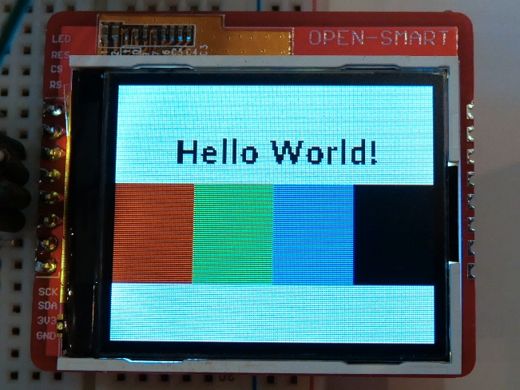

# 1.8" ILI9163C TFT LCD
*aka a Nokia 5110 LCD replacement*

I've found this mostly undocumented display to be a great replacement for the aging Nokia 5110 display. See the article [here](http://embedblog.eu/?p=547).

I've written a driver, compatible with STM32F030. I've also made an Eagle library with a couple of possible mounting options for this display.